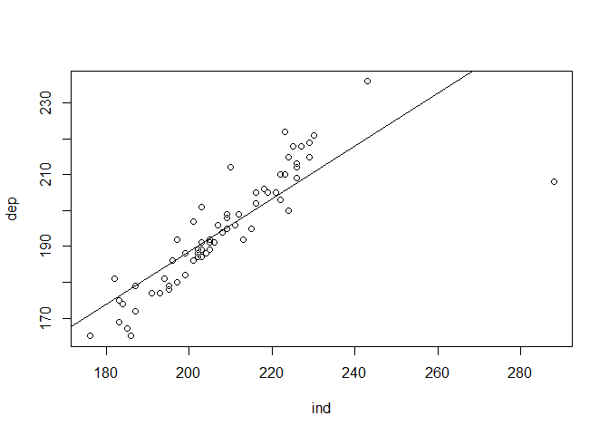
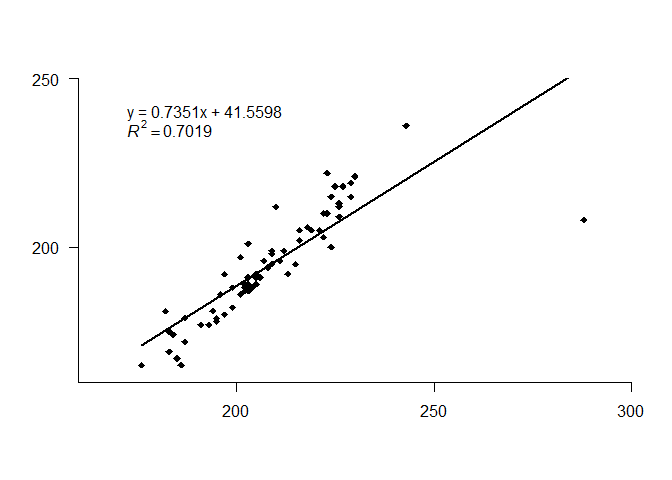
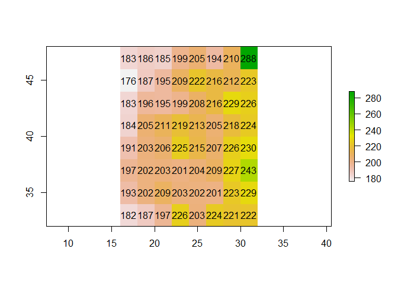
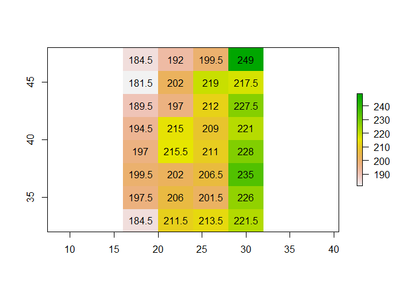
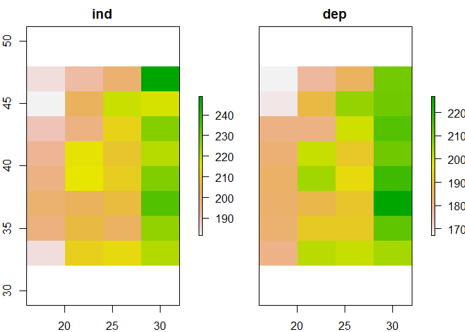
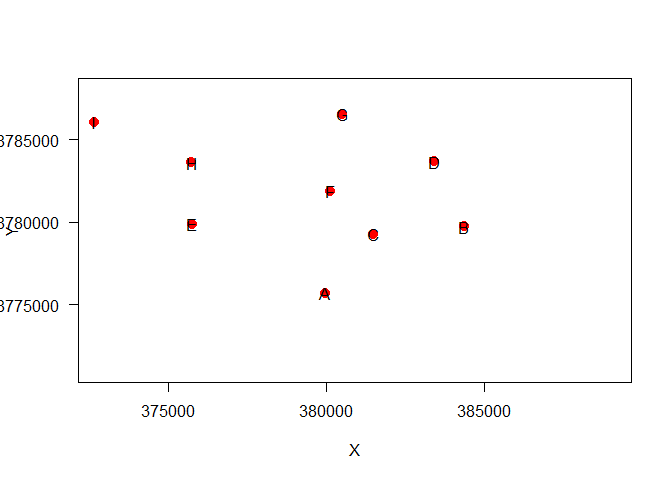
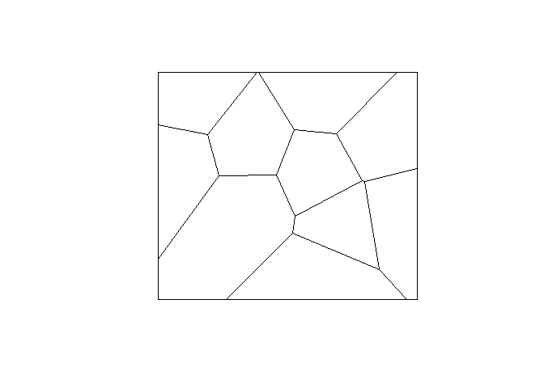
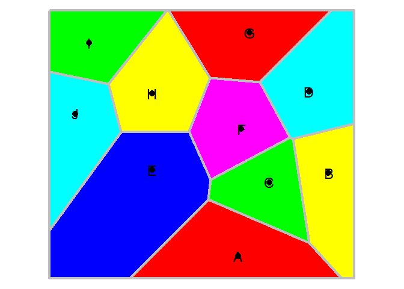

Aplicaciones multiples
================

``` r
ind <- c(183,186,185,199,205,194,210,288,
         176,187,195,209,222,216,212,223,
         183,196,195,199,208,216,229,226,
         184,205,211,219,213,205,218,224,
         191,203,206,225,215,207,226,230,
         197,202,203,201,204,209,227,243,
         193,202,209,203,202,201,223,229,
         182,187,197,226,203,224,221,222)
# dependent variable
dep <- c(169,165,167,188,189,181,212,208,
         165,172,178,199,210,202,199,222,
         175,186,179,182,194,205,219,209,
         174,191,196,205,192,192,206,215,
         177,191,191,218,195,196,213,221,
         180,187,189,186,188,195,218,236,
         177,189,198,187,188,197,210,215,
         181,179,192,212,201,200,205,203)

# mostramos la grafica de dispersion de velores.
plot(ind, dep)

#intentamos generar el modelo de regresión 
m <- glm(dep ~ ind)
summary(m)
```

    ## 
    ## Call:
    ## glm(formula = dep ~ ind)
    ## 
    ## Deviance Residuals: 
    ##     Min       1Q   Median       3Q      Max  
    ## -45.255   -3.576   -0.215    4.560   16.524  
    ## 
    ## Coefficients:
    ##             Estimate Std. Error t value Pr(>|t|)    
    ## (Intercept) 41.55982   12.71908   3.268  0.00177 ** 
    ## ind          0.73505    0.06083  12.084  < 2e-16 ***
    ## ---
    ## Signif. codes:  0 '***' 0.001 '**' 0.01 '*' 0.05 '.' 0.1 ' ' 1
    ## 
    ## (Dispersion parameter for gaussian family taken to be 73.8383)
    ## 
    ##     Null deviance: 15359  on 63  degrees of freedom
    ## Residual deviance:  4578  on 62  degrees of freedom
    ## AIC: 460.91
    ## 
    ## Number of Fisher Scoring iterations: 2

``` r
# agregamos el modelo de regresion en la que incluye la linea 
plot(ind, dep)
abline(m)
```

<!-- -->

``` r
#######
# Agregrando más recursos para la grafica. 
plot(ind, dep, pch=18, xlim=c(160,300), ylim=c(160,250),
    axes=FALSE, xlab='', ylab='', yaxs="i", xaxs="i")
axis(1, at=(3:6)*50)
axis(2, at=(3:5)*50, las=1)
# Creando la formula de la regresion 
f <- paste0('y = ', round(m$coefficients[2], 4), 'x + ', round(m$coefficients[1], 4))
# Adicionando el texto de la ecuación 
text(170, 240, f, pos=4)
# indicando el valor de R^2
R2 <- cor(dep, predict(m))^2

r2 <- bquote(italic(R)^2 == .(round(R2, 4)))
# adicionando el texto indicando su posición 
text(170, 235, r2, pos=4)
# Caluclamos la linea de la regresión 
px <- data.frame(ind = range(ind))
# presentando el model de regresión 
py <- predict(m, px)
# Combinando los valores para la predición 
ln <- cbind(px, py)
# aAdicionamos la linea en la grafica 
lines(ln, lwd=2)

#Conviertiendo los valores vectoriales en matriciales 
mi <- matrix(ind, ncol=8, nrow=8, byrow=TRUE,)
md <- matrix(dep, ncol=8, nrow=8, byrow=TRUE)

# Cargamos la libreria
library(raster)
```

    ## Loading required package: sp

<!-- -->

``` r
# convirtiendo los valores 
ri <- raster(mi, xmn=16, xmx=32, ymn=32, ymx=48, crs="+proj=longlat +datum=WGS84 +no_defs")
rd <- raster(md, xmn=16, xmx=32, ymn=32, ymx=48, crs="+proj=longlat +datum=WGS84 +no_defs")
ri
```

    ## class      : RasterLayer 
    ## dimensions : 8, 8, 64  (nrow, ncol, ncell)
    ## resolution : 2, 2  (x, y)
    ## extent     : 16, 32, 32, 48  (xmin, xmax, ymin, ymax)
    ## crs        : +proj=longlat +datum=WGS84 +no_defs +ellps=WGS84 +towgs84=0,0,0 
    ## source     : memory
    ## names      : layer 
    ## values     : 176, 288  (min, max)

``` r
# postrando el dato 
plot(ri, legend=TRUE)
text(ri)
```

<!-- -->

``` r
# agregando otras funciones 

ai1 <- aggregate(ri, c(2, 1), fun=mean)
ad1 <- aggregate(rd, c(2, 1), fun=mean)
ai1
```

    ## class      : RasterLayer 
    ## dimensions : 8, 4, 32  (nrow, ncol, ncell)
    ## resolution : 4, 2  (x, y)
    ## extent     : 16, 32, 32, 48  (xmin, xmax, ymin, ymax)
    ## crs        : +proj=longlat +datum=WGS84 +no_defs +ellps=WGS84 +towgs84=0,0,0 
    ## source     : memory
    ## names      : layer 
    ## values     : 181.5, 249  (min, max)

``` r
#Covirtiendo un raster en una matriz
as.matrix(ai1)
```

    ##       [,1]  [,2]  [,3]  [,4]
    ## [1,] 184.5 192.0 199.5 249.0
    ## [2,] 181.5 202.0 219.0 217.5
    ## [3,] 189.5 197.0 212.0 227.5
    ## [4,] 194.5 215.0 209.0 221.0
    ## [5,] 197.0 215.5 211.0 228.0
    ## [6,] 199.5 202.0 206.5 235.0
    ## [7,] 197.5 206.0 201.5 226.0
    ## [8,] 184.5 211.5 213.5 221.5

``` r
#mostrando en la imagen 
plot(ai1)
text(ai1, digits=1)
```

<!-- -->

``` r
#
s1 <- stack(ai1, ad1)
names(s1) <- c('ind', 'dep')
s1
```

    ## class      : RasterStack 
    ## dimensions : 8, 4, 32, 2  (nrow, ncol, ncell, nlayers)
    ## resolution : 4, 2  (x, y)
    ## extent     : 16, 32, 32, 48  (xmin, xmax, ymin, ymax)
    ## crs        : +proj=longlat +datum=WGS84 +no_defs +ellps=WGS84 +towgs84=0,0,0 
    ## names      :   ind,   dep 
    ## min values : 181.5, 167.0 
    ## max values :   249,   227

``` r
plot(s1)
```

<!-- -->

``` r
d1 <- as.data.frame(s1)
head(d1)
```

    ##     ind   dep
    ## 1 184.5 167.0
    ## 2 192.0 177.5
    ## 3 199.5 185.0
    ## 4 249.0 210.0
    ## 5 181.5 168.5
    ## 6 202.0 188.5

``` r
ma1 <- glm(dep~ind, data=d1)
summary(ma1)
```

    ## 
    ## Call:
    ## glm(formula = dep ~ ind, data = d1)
    ## 
    ## Deviance Residuals: 
    ##      Min        1Q    Median        3Q       Max  
    ## -20.2211   -2.2050   -0.1323    2.8075    9.0095  
    ## 
    ## Coefficients:
    ##             Estimate Std. Error t value Pr(>|t|)    
    ## (Intercept) 12.69036   12.78372   0.993    0.329    
    ## ind          0.87362    0.06119  14.276 6.48e-15 ***
    ## ---
    ## Signif. codes:  0 '***' 0.001 '**' 0.01 '*' 0.05 '.' 0.1 ' ' 1
    ## 
    ## (Dispersion parameter for gaussian family taken to be 27.90342)
    ## 
    ##     Null deviance: 6523.9  on 31  degrees of freedom
    ## Residual deviance:  837.1  on 30  degrees of freedom
    ## AIC: 201.27
    ## 
    ## Number of Fisher Scoring iterations: 2

``` r
#  Aplicacaiones basicas de cálculo de distancia, adyacencia, interacción, vecindario
# ingresado lavores de coordenadas 

A <- c(379959.17,8775681.60)
B <- c(384370.49,8779719.34)
C <- c(381480.27,8779262.48)
D <- c(383410.69,8783663.41)
E <- c(375770.15,8779871.67)
G <- c(380119.93,8781854.88)
H <- c(380519.25,8786540.54)
I <- c(375755.39,8783592.40)
J <- c(372685.60,8786042.43)
K <- c(372006.39,8782604.28)

#integrando los valores de las coordenadas 
pts <- rbind(A,B,C,D,E,G,H,I,J,K)
head(pts)
```

    ##       [,1]    [,2]
    ## A 379959.2 8775682
    ## B 384370.5 8779719
    ## C 381480.3 8779262
    ## D 383410.7 8783663
    ## E 375770.2 8779872
    ## G 380119.9 8781855

``` r
pts
```

    ##       [,1]    [,2]
    ## A 379959.2 8775682
    ## B 384370.5 8779719
    ## C 381480.3 8779262
    ## D 383410.7 8783663
    ## E 375770.2 8779872
    ## G 380119.9 8781855
    ## H 380519.2 8786541
    ## I 375755.4 8783592
    ## J 372685.6 8786042
    ## K 372006.4 8782604

``` r
# intentando mostrar las los puntos en el espacio
plot(pts, xlim=c(372825,389000), ylim=c(8771000,8788000), pch=20, cex=2, col='red', xlab='X', ylab='Y', las=1)
text(pts+5, LETTERS[1:10])
```

<!-- -->

``` r
dis <- dist(pts)
dis
```

    ##           A         B         C         D         E         G         H
    ## B  5980.225                                                            
    ## C  3890.559  2926.105                                                  
    ## D  8696.107  4059.175  4805.695                                        
    ## E  5924.911  8601.689  5742.524  8529.663                              
    ## G  6175.373  4756.868  2927.638  3754.981  4780.555                    
    ## H 10873.374  7833.315  7341.234  4079.008  8187.049  4702.645          
    ## I  8958.377  9445.663  7177.915  7655.629  3720.759  4697.679  5602.311
    ## J 12659.053 13286.012 11104.681 10985.777  6898.748  8532.575  7849.470
    ## K 10543.728 12696.214 10045.996 11453.376  4651.134  8148.075  9378.855
    ##           I         J
    ## B                    
    ## C                    
    ## D                    
    ## E                    
    ## G                    
    ## H                    
    ## I                    
    ## J  3927.627          
    ## K  3877.033  3504.597

``` r
disma <- as.matrix(dis)
round(disma)
```

    ##       A     B     C     D    E    G     H    I     J     K
    ## A     0  5980  3891  8696 5925 6175 10873 8958 12659 10544
    ## B  5980     0  2926  4059 8602 4757  7833 9446 13286 12696
    ## C  3891  2926     0  4806 5743 2928  7341 7178 11105 10046
    ## D  8696  4059  4806     0 8530 3755  4079 7656 10986 11453
    ## E  5925  8602  5743  8530    0 4781  8187 3721  6899  4651
    ## G  6175  4757  2928  3755 4781    0  4703 4698  8533  8148
    ## H 10873  7833  7341  4079 8187 4703     0 5602  7849  9379
    ## I  8958  9446  7178  7656 3721 4698  5602    0  3928  3877
    ## J 12659 13286 11105 10986 6899 8533  7849 3928     0  3505
    ## K 10544 12696 10046 11453 4651 8148  9379 3877  3505     0

``` r
a <-  disma < 5000
a
```

    ##       A     B     C     D     E     G     H     I     J     K
    ## A  TRUE FALSE  TRUE FALSE FALSE FALSE FALSE FALSE FALSE FALSE
    ## B FALSE  TRUE  TRUE  TRUE FALSE  TRUE FALSE FALSE FALSE FALSE
    ## C  TRUE  TRUE  TRUE  TRUE FALSE  TRUE FALSE FALSE FALSE FALSE
    ## D FALSE  TRUE  TRUE  TRUE FALSE  TRUE  TRUE FALSE FALSE FALSE
    ## E FALSE FALSE FALSE FALSE  TRUE  TRUE FALSE  TRUE FALSE  TRUE
    ## G FALSE  TRUE  TRUE  TRUE  TRUE  TRUE  TRUE  TRUE FALSE FALSE
    ## H FALSE FALSE FALSE  TRUE FALSE  TRUE  TRUE FALSE FALSE FALSE
    ## I FALSE FALSE FALSE FALSE  TRUE  TRUE FALSE  TRUE  TRUE  TRUE
    ## J FALSE FALSE FALSE FALSE FALSE FALSE FALSE  TRUE  TRUE  TRUE
    ## K FALSE FALSE FALSE FALSE  TRUE FALSE FALSE  TRUE  TRUE  TRUE

``` r
b<-disma>5500
b
```

    ##       A     B     C     D     E     G     H     I     J     K
    ## A FALSE  TRUE FALSE  TRUE  TRUE  TRUE  TRUE  TRUE  TRUE  TRUE
    ## B  TRUE FALSE FALSE FALSE  TRUE FALSE  TRUE  TRUE  TRUE  TRUE
    ## C FALSE FALSE FALSE FALSE  TRUE FALSE  TRUE  TRUE  TRUE  TRUE
    ## D  TRUE FALSE FALSE FALSE  TRUE FALSE FALSE  TRUE  TRUE  TRUE
    ## E  TRUE  TRUE  TRUE  TRUE FALSE FALSE  TRUE FALSE  TRUE FALSE
    ## G  TRUE FALSE FALSE FALSE FALSE FALSE FALSE FALSE  TRUE  TRUE
    ## H  TRUE  TRUE  TRUE FALSE  TRUE FALSE FALSE  TRUE  TRUE  TRUE
    ## I  TRUE  TRUE  TRUE  TRUE FALSE FALSE  TRUE FALSE FALSE FALSE
    ## J  TRUE  TRUE  TRUE  TRUE  TRUE  TRUE  TRUE FALSE FALSE FALSE
    ## K  TRUE  TRUE  TRUE  TRUE FALSE  TRUE  TRUE FALSE FALSE FALSE

``` r
#Calculo de vecino más cercanos


cols <- apply(disma, 1, order)
# we need to transpose the result
cols <- t(cols)

cols <- cols[, 2:8]
cols
```

    ##   [,1] [,2] [,3] [,4] [,5] [,6] [,7]
    ## A    3    5    2    6    4    8   10
    ## B    3    4    6    1    7    5    8
    ## C    2    6    1    4    5    8    7
    ## D    6    2    7    3    8    5    1
    ## E    8   10    6    3    1    9    7
    ## G    3    4    8    7    2    5    1
    ## H    4    6    8    3    2    9    5
    ## I    5   10    9    6    7    3    4
    ## J   10    8    5    7    6    4    3
    ## K    9    8    5    6    7    3    1

``` r
#Calculando la Matriz de pesos

W <- 1 / disma
round(W, 4)
```

    ##       A     B     C     D     E     G     H     I     J     K
    ## A   Inf 2e-04 3e-04 1e-04 2e-04 2e-04 1e-04 1e-04 1e-04 1e-04
    ## B 2e-04   Inf 3e-04 2e-04 1e-04 2e-04 1e-04 1e-04 1e-04 1e-04
    ## C 3e-04 3e-04   Inf 2e-04 2e-04 3e-04 1e-04 1e-04 1e-04 1e-04
    ## D 1e-04 2e-04 2e-04   Inf 1e-04 3e-04 2e-04 1e-04 1e-04 1e-04
    ## E 2e-04 1e-04 2e-04 1e-04   Inf 2e-04 1e-04 3e-04 1e-04 2e-04
    ## G 2e-04 2e-04 3e-04 3e-04 2e-04   Inf 2e-04 2e-04 1e-04 1e-04
    ## H 1e-04 1e-04 1e-04 2e-04 1e-04 2e-04   Inf 2e-04 1e-04 1e-04
    ## I 1e-04 1e-04 1e-04 1e-04 3e-04 2e-04 2e-04   Inf 3e-04 3e-04
    ## J 1e-04 1e-04 1e-04 1e-04 1e-04 1e-04 1e-04 3e-04   Inf 3e-04
    ## K 1e-04 1e-04 1e-04 1e-04 2e-04 1e-04 1e-04 3e-04 3e-04   Inf

``` r
W[!is.finite(W)] <- NA


rtot <- rowSums(W, na.rm=TRUE)
# this is equivalent to
# rtot <- apply(W, 1, sum, na.rm=TRUE)
rtot
```

    ##           A           B           C           D           E           G 
    ## 0.001247390 0.001469362 0.001787709 0.001507105 0.001536455 0.001854666 
    ##           H           I           J           K 
    ## 0.001348310 0.001660102 0.001264836 0.001348081

``` r
W <- W / rtot
rowSums(W, na.rm=TRUE)
```

    ## A B C D E G H I J K 
    ## 1 1 1 1 1 1 1 1 1 1

``` r
colSums(W, na.rm=TRUE)
```

    ##         A         B         C         D         E         G         H         I 
    ## 0.7993025 0.9540848 1.2042037 0.9933858 1.0289870 1.2464443 0.8809625 1.1408538 
    ##         J         K 
    ## 0.8423758 0.9093998

``` r
# Aplicacaiones de Polígonos de proximidad
#cargamos la libreria
library(dismo)
library(deldir)
```

    ## deldir 0.1-23

``` r
#Algoritmo de boronoi
v <- voronoi(pts)
v
```

    ## class       : SpatialPolygonsDataFrame 
    ## features    : 10 
    ## extent      : 370770, 385606.9, 8774596, 8787626  (xmin, xmax, ymin, ymax)
    ## crs         : NA 
    ## variables   : 1
    ## names       : id 
    ## min values  :  1 
    ## max values  : 10

``` r
plot(v)
```

<!-- -->

``` r
#Intentando mostrar a colores.
par(mai=rep(0,4))
plot(v, lwd=4, border='gray', col=rainbow(6))
points(pts, pch=20, cex=2)
text(pts+5, toupper(letters[1:10]), cex=1.5)
```

<!-- -->
